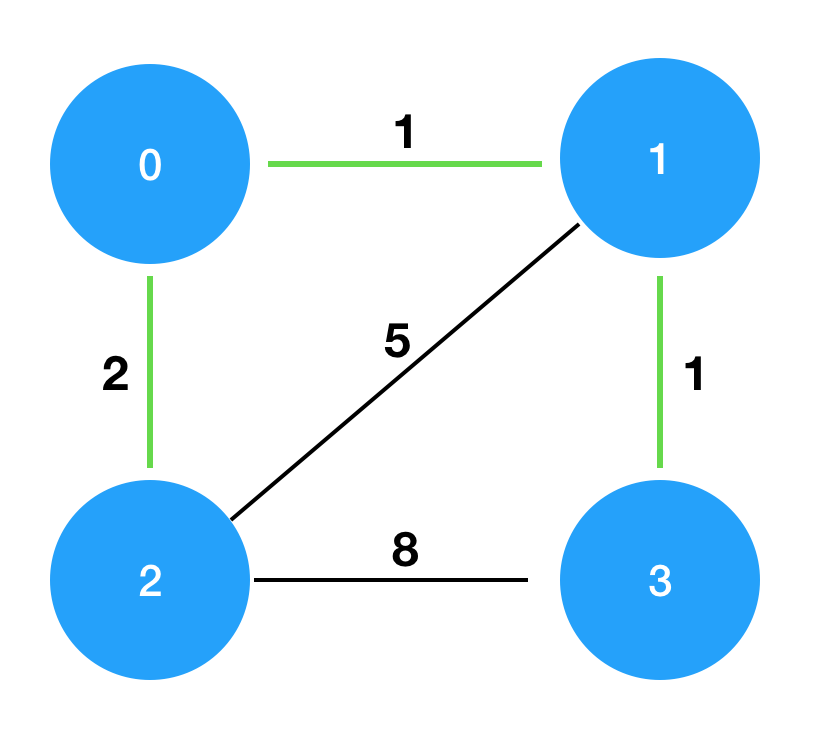

# 프로그래머스(Programmers)
programmers

<details>
<summary>2. Joysteak</summary>

<a href="https://programmers.co.kr/learn/courses/30/lessons/42860">문제 설명</a>
<br>
조이스틱으로 알파벳 이름을 완성하세요. 맨 처음엔 A로만 이루어져 있습니다.
ex) 완성해야 하는 이름이 세 글자면 AAA, 네 글자면 AAAA

조이스틱을 각 방향으로 움직이면 아래와 같습니다.
```python3
▲ - 다음 알파벳
▼ - 이전 알파벳 (A에서 아래쪽으로 이동하면 Z로)
◀ - 커서를 왼쪽으로 이동 (첫 번째 위치에서 왼쪽으로 이동하면 마지막 문자에 커서)
▶ - 커서를 오른쪽으로 이동
```
예를 들어 아래의 방법으로 "JAZ"를 만들 수 있습니다.
```
- 첫 번째 위치에서 조이스틱을 위로 9번 조작하여 J를 완성합니다.
- 조이스틱을 왼쪽으로 1번 조작하여 커서를 마지막 문자 위치로 이동시킵니다.
- 마지막 위치에서 조이스틱을 아래로 1번 조작하여 Z를 완성합니다.
따라서 11번 이동시켜 "JAZ"를 만들 수 있고, 이때가 최소 이동입니다.
```
만들고자 하는 이름 name이 매개변수로 주어질 때, 이름에 대해 조이스틱 조작 횟수의 최솟값을 return 하도록 solution 함수를 만드세요.

제한 사항
* name은 알파벳 대문자로만 이루어져 있습니다.
* name의 길이는 1 이상 20 이하입니다.

입출력 예   
| name | return |
|---|:---:|
|"JEROEN"|56
|"JAN"|23

<a href="https://commissies.ch.tudelft.nl/chipcie/archief/2010/nwerc/nwerc2010.pdf">출처</a>   
※ 공지 - 2019년 2월 28일 테스트케이스가 추가 되었습니다.
</details>

<details open>
<summary>3. 섬 연결하기 </summary>
<a href="https://programmers.co.kr/learn/courses/30/lessons/42861">문제 설명</a>
<br>
n개의 섬 사이에 다리를 건설하는 비용(costs)이 주어질 때, 최소의 비용으로 모든 섬이 서로 통행 가능하도록 만들 때 필요한 최소 비용을 return 하도록 solution을 완성하세요.    

다리를 여러 번 건너더라도, 도달할 수만 있으면 통행 가능하다고 봅니다. 예를 들어 A 섬과 B 섬 사이에 다리가 있고, B 섬과 C 섬 사이에 다리가 있으면 A 섬과 C 섬은 서로 통행 가능합니다.

**제한사항**
* 섬의 개수 n은 1이상 100 이하입니다.
* costs의 길이는 ```((n-1) * n) / 2``` 이하입니다.
* 임의의 i에 대해, costs[i] [0] 와 costs[i] [1]에는 다리가 연결되는 두 섬의 번호가 들어있고, costs[i] [2]에는 이 두 섬을 연결하는 다리를 건설할 때 드는 비용입니다.
* 같은 연결은 두 번 주어지지 않습니다. 또한 순서가 바뀌더라도 같은 연결로 봅니다. 즉 0과 1 사이를 연결하는 비용이 주어졌을 때, 1과 0의 비용이 주어지지 않습니다.
* 모든 섬 사이의 다리 건설 비용이 주어지지 않습니다. 이 경우, 두 섬 사이의 건설이 불가능한 것으로 봅니다.
* 연결할 수 없는 섬은 주어지지 않습니다.

**입출력 예**
|n|costs|return|
|---|:---:|:---:|
|4|[[0,1,1],[0,2,2],[1,2,5],[1,3,1],[2,3,8]]|4

**입출력 예 설명**   
costs를 그림으로 표현하면 다음과 같으며, 이때 초록색 경로로 연결하는 것이 가장 적은 비용으로 모두를 통행할 수 있도록 만드는 방법입니다.

</img>
</details>